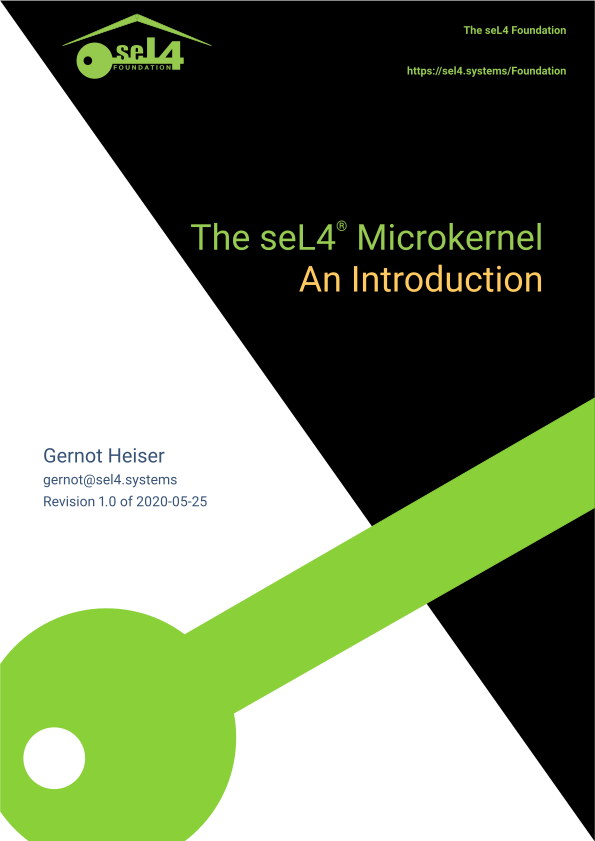

  

seL4 is a high-assurance, high-performance operating system microkernel. It is
unique because of its comprehensive formal [verification](../Verification/),
without compromising [performance](../performance.html). seL4 is designed as a
trustworthy foundation for building safety- and security-critical systems. It is
available as open source on [GitHub](https://github.com/seL4/) and supported by
the [seL4 Foundation](../Foundation/).

seL4 is a *kernel*. This means it is at the heart of any software system it runs
in, and controls all access to  resources. It provides fine-grained control for
that access through
[capabilities](https://en.wikipedia.org/wiki/Capability-based_security), and
controls communication between components of the system. The kernel runs in a
higher privilege mode of the hardware -- this means it can do more harm than
other software and its correctness is therefore critical for the entire system.

seL4 is also a *microkernel*. This means that it is reduced to a minimal
policy-free core and can therefore form a dependable basis for building
arbitrary systems in many different usage scenarios.

seL4 is a member of the [L4 family of
microkernels](https://en.wikipedia.org/wiki/L4_microkernel_family "L4
microkernel family on wikipedia"), and is the world's most advanced, most highly
assured operating-system kernel. It can be [used](how-to-use.html) as a
hypervisor or as an RTOS, or both, or as the basis for a general purpose
operating system.

seL4's [formal verification](../Verification/) sets it apart from any other
operating system. In a nutshell, it provides the highest assurance of
*isolation* between applications running in the system, meaning that a
compromise in one part of the system can be contained and prevented from harming
other, potentially more critical parts of the system.

Specifically, seL4's implementation is formally (mathematically) proven correct
against its specification and has been proved to enforce strong security
properties. It was the world's first operating system with such a proof, and is
still the only proven operating system featuring fine-grained capability-based
security and high performance. It also has the most advanced support for [mixed
criticality real-time systems](https://en.wikipedia.org/wiki/Mixed_criticality).

The figure below shows one of the uses for seL4: isolation between trusted and
untrusted components in a system, including full virtual machines.

{% svg /images/sel4-principles.drawio.svg width="100%" %}

In the diagram, the seL4 kernel is the layer directly above the hardware and
mediates access to it. The diagram shows multiple software components running on
top of seL4: a virtual machine with untrusted code, native applications with
untrusted code, and native applications with critical trusted code. The kernel
isolates trusted from untrusted code and provides secure, controlled
communication between them. In the example, the system is configured to only
allow communication via the trusted applications, which for instance, could
implement custom security policies.

For detailed explanations of the terms used in this page, see our
[FAQ](FAQ.html). For a more detailed introduction to seL4, read the full [White
Paper](seL4-whitepaper.pdf).
